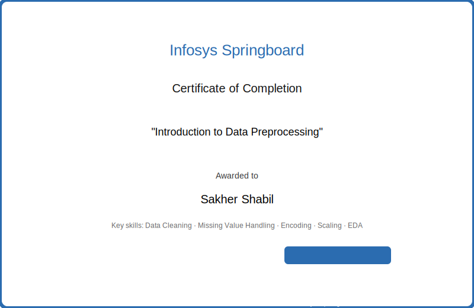

<<<<<<< HEAD
# Data-Preprocessing-and-Feature-Engineering-Assignments
A professional collection of Data Preprocessing assignments covering data cleaning, transformation, feature engineering, visualization, normalization, encoding, and exploratory data analysis using Python and Machine Learning libraries.
=======
# Data Preprocessing and Feature Engineering Assignments

**Repository overview:**

This repository contains a curated collection of data preprocessing assignments and a course completion certificate. The materials demonstrate practical skills in data cleaning, missing value handling, feature engineering, encoding, scaling, outlier detection, exploratory data analysis and visualization using Python and standard data-science libraries.

**Project objectives:**
- Provide clean, well-documented notebooks that showcase data preprocessing workflows.
- Make the repository recruiter-friendly and suitable for portfolio presentation.
- Document learning outcomes, tools used, and suggested future improvements.

**Learning outcomes:**
- Practical data cleaning and transformation techniques
- Handling missing values and duplicates
- Feature engineering and encoding strategies
- Scaling and normalization for model readiness
- Exploratory analysis and visualization best practices

# Data Preprocessing and Feature Engineering Assignments

**Repository overview:**

This repository contains a curated collection of data preprocessing assignments and a course completion certificate. The materials demonstrate practical skills in data cleaning, missing value handling, feature engineering, encoding, scaling, outlier detection, exploratory data analysis and visualization using Python and standard data-science libraries.

**Project objectives:**
- Provide clean, well-documented notebooks that showcase data preprocessing workflows.
- Make the repository recruiter-friendly and suitable for portfolio presentation.
- Document learning outcomes, tools used, and suggested future improvements.

**Learning outcomes:**
- Practical data cleaning and transformation techniques
- Handling missing values and duplicates
- Feature engineering and encoding strategies
- Scaling and normalization for model readiness
- Exploratory analysis and visualization best practices

**Tools & technologies:**
- Python, Pandas, NumPy
- Matplotlib, Seaborn
- Scikit-learn
- Google Colab (notebooks prepared for Colab paths)

**Repository structure:**
- Assignment-01_Data_Cleaning_Customer/ — Customer dataset preprocessing notebook
- Assignment-02_Exploratory_Data_Analysis_Penguin/ — Penguins EDA and imputation
- Assignment-08_Tips_and_Tricks/ — Practical preprocessing tips and examples
- Assignment-10_Project_Report/ — Project-style preprocessing report
- Certificates/ — Certifications and images

**Certifications**

**Introduction to Data Preprocessing** — Infosys Springboard

Short description: Completed the "Introduction to Data Preprocessing" course on Infosys Springboard covering data cleaning, missing value strategies, encoding, scaling, and EDA. The course emphasizes practical, hands-on preprocessing techniques for preparing datasets for machine learning.

Key skills learned:
- Data cleaning and duplicate handling
- Missing value imputation strategies
- Feature encoding and scaling
- Exploratory data analysis and visualization

**Future improvements:**
- Add unit tests and lightweight data-validation scripts
- Add more polished final reports and slides for each assignment
- Add small modeling notebooks to show before/after preprocessing effects
- Include links to live Colab copies for easier reviewer execution

**GitHub topics:** Data-Preprocessing, Data-Cleaning, Feature-Engineering, EDA, Python, Machine-Learning, Data-Visualization
